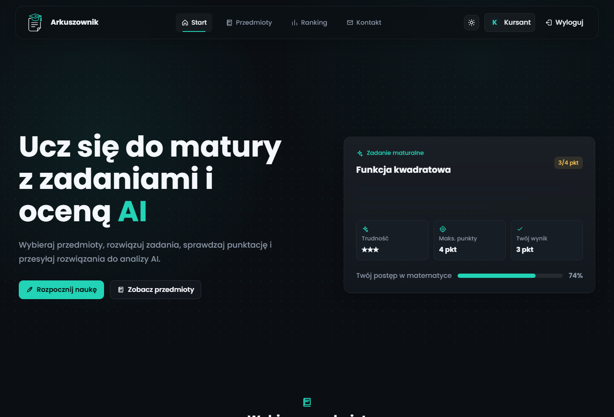
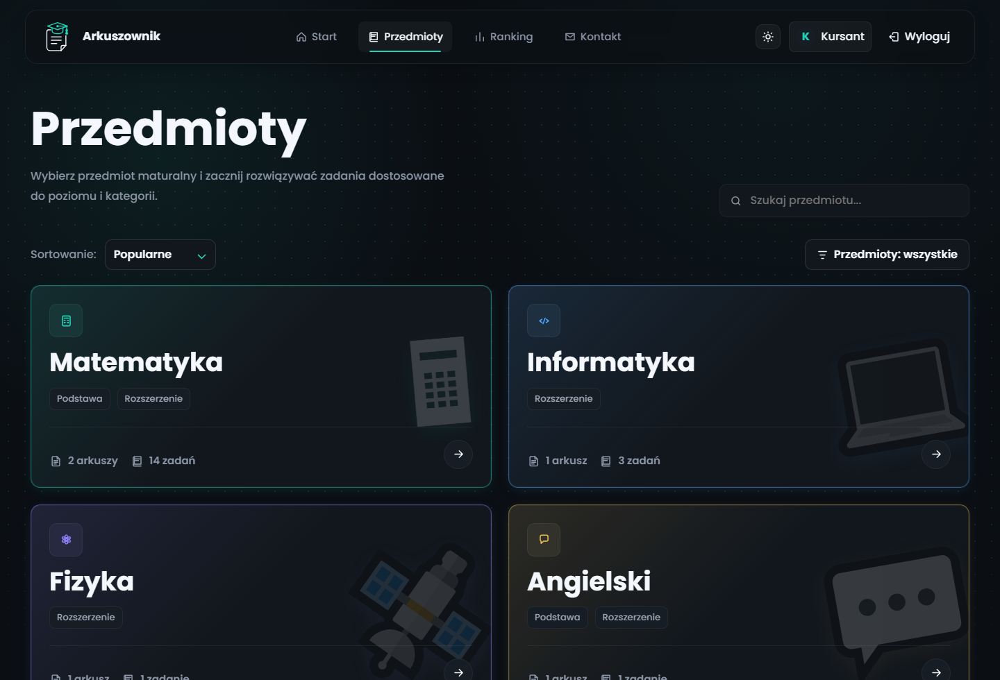
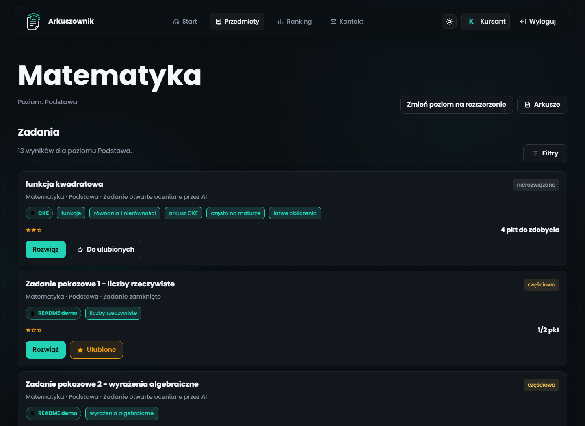
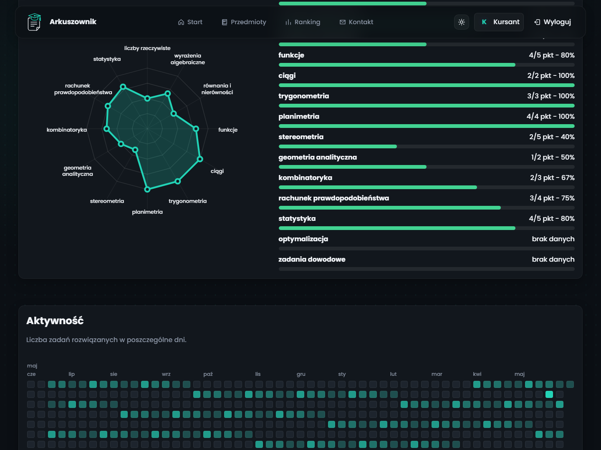

# Arkuszownik

> A prototype learning platform for Polish matura preparation, with subjects, tasks, exam sheets, progress statistics, an admin panel, and a local PDF import agent.

Arkuszownik is a browser-based study app for practicing exam tasks in one place. Students can choose a subject and level, solve individual tasks or full exam sheets, check their score, and track progress over time. Admin users can manage subjects, categories, tags, tasks, sheets, visibility settings, and imported PDF content.

## Preview

The screenshots below use demo data to show the most important parts of the application.









## Key Features

- **Subject catalog** for mathematics, physics, English, and computer science.
- **Task practice mode** with filters for level, category, tags, and difficulty.
- **Exam sheet mode** with timing, scoring, closed-answer handling, and attempt history.
- **User profile** with progress summaries, skill maps, daily activity, favorite tasks, and recent submissions.
- **Admin panel** for editing content, colors, tags, visibility, sheets, and prototype settings.
- **Local PDF importer** that extracts tasks from exam sheets and stores corrections for later improvement.
- **Optional local vision import** through Ollama for reading PDF pages and screenshots without sending files to an external API.

## Prototype Model Note

The project includes an experimental custom PDF line-classification model used by the local import agent. It is still a prototype: the model can help detect task headers, body text, answer areas, and noise in matura PDFs, but imported tasks should be reviewed and corrected by a user before being treated as final content.

The current pipeline is designed for local experimentation and further training, not production-grade automatic exam parsing.

## Tech Stack

| Layer | Tools |
| --- | --- |
| Frontend | HTML, CSS, JavaScript, `localStorage` |
| Math rendering | KaTeX |
| Browser PDF import fallback | pdf.js |
| Local PDF agent | Python, `http.server`, PyMuPDF, pypdf, scikit-learn |
| Experimental model | TF-IDF line features, MLP classifier, optional Torch/GPU artifacts |
| Optional vision import | Ollama + Qwen VL models |

## Quick Start

The simplest mode does not require a backend:

```powershell
start index.html
```

You can also open `index.html` manually in a browser. Prototype data is stored locally in `localStorage`.

## Running With The Local PDF Agent

The agent runs locally at `http://127.0.0.1:8765/` and supports PDF sheet import.

1. Install dependencies:

```powershell
pip install -r pdf_agent/requirements.txt
```

2. Start the agent server:

```powershell
.\start_pdf_agent.ps1
```

3. Open the app:

```text
http://127.0.0.1:8765/
```

To rebuild the training dataset or retrain the line classifier:

```powershell
python scripts/build_pdf_training_set.py
python scripts/train_pdf_agent.py
```

## Ollama Vision Import

The import panel includes an `Ollama Qwen Vision (local)` mode. It renders PDF pages to images and asks a local vision model to extract task text and LaTeX-ready math content.

```powershell
ollama pull qwen3-vl:4b-instruct
.\start_pdf_agent.ps1
```

You can choose another model before starting the server:

```powershell
$env:OLLAMA_PDF_MODEL = "qwen2.5vl:7b"
.\start_pdf_agent.ps1
```

## Test Accounts

| Role | Email | Password |
| --- | --- | --- |
| Admin | `admin@arkuszownik.pl` | `admin123` |
| User | `user@arkuszownik.pl` | `user123` |

## Project Structure

```text
maturalab/
|-- index.html              # main application file
|-- styles.css              # layout, theme, and responsive styling
|-- app.js                  # SPA logic, seed data, and routing
|-- assets/graphics/        # subject and mode graphics
|-- assets/screenshots/     # README screenshots
|-- pdf_agent/              # local PDF import agent
|-- scripts/                # dataset and model training scripts
`-- start_pdf_agent.ps1     # local server launcher
```

## Privacy And Scope

The frontend is a static app and stores user data locally in the browser. The local PDF agent does not upload files to external services. The AI-style scoring flow in the prototype is simulated from task criteria and checker configuration.

## Improving Imports With Feedback

After importing a PDF, users can edit recognized tasks in the preview and create a sheet from the corrected content. The agent stores `PDF version -> corrected version` pairs in:

```text
pdf_agent/data/feedback/import_corrections.jsonl
```

Accepted corrections are used to rebuild a local memory of LaTeX fixes:

```text
pdf_agent/data/feedback/latex_corrections.json
```

Rebuild the feedback memory with:

```powershell
python scripts/rebuild_pdf_feedback_memory.py
```

Co-developed by mkulas07
"" 
"Co-developed by mkulas07." 
